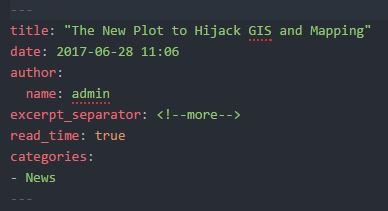
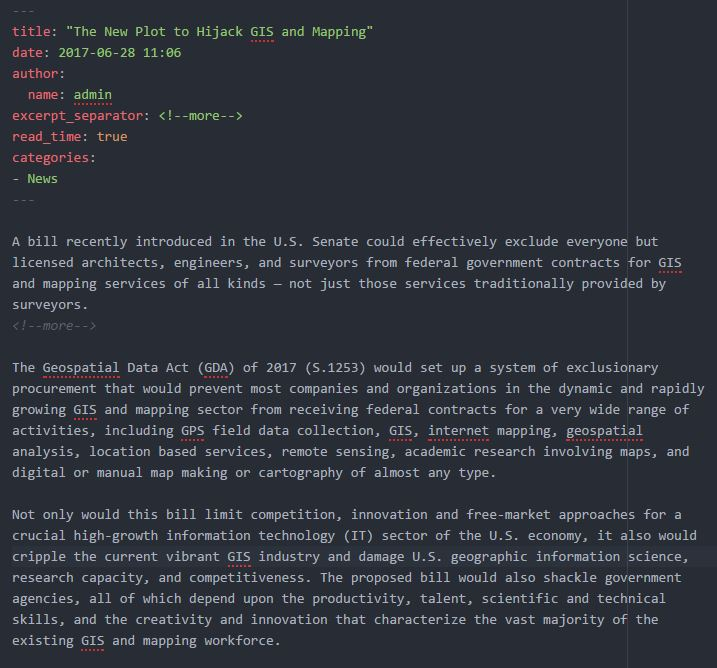
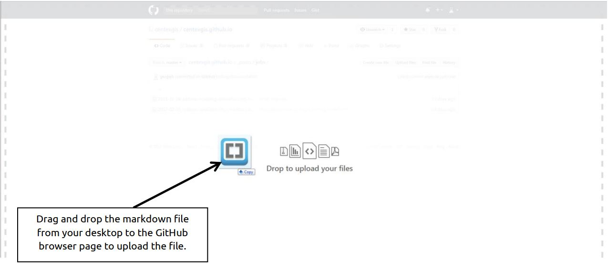

### About
The CenTex GIS website is built using the [Jekyll](http://jekyllrb.com/docs/home/) static site generator. The theme is called [Basically Basic](https://github.com/mmistakes/jekyll-theme-basically-basic) and was developed by Michael Rose / [mmistakes](https://github.com/mmistakes). The site is hosted directly from this GitHub repo and includes a CNAME file in the root directory for the custom domain [centexgis.com](http://centexgis.com).

------------------------
### Create/Add New Posts
Posts to the centexgis.com site are written in [markdown](https://daringfireball.net/projects/markdown/syntax) format which is intended to be an easy-to-read and easy-to-write syntax for text-to-HTML. Many blogs on the web utilize markdown or similar syntax to speed up the publishing process since HTML can be cumbersome to read and write. The following are steps to add a new job, event, or news post to centexgis.com.

1. Login to [https://github.com](https://github.com) and navigate to the centexgis organization account – if you do not have a github account, create one and then request to be added as a member to centexgis.

2. The repository (repo) for the site content is called centexgis.github.io. Navigate to that repo by clicking the repo name on the centexgis account main page or [click here](https://github.com/centexgis/centexgis.github.io).

3. The existing site posts are located in the `_posts` folder in the `centexgis.github.io` repo. Click the `_posts` folder. Inside you will see the category folders, each consisting of markdown formatted posts. For example, in the jobs folder you should see all the jobs that are currently posted on the centexgis.com site.

4. To add a new post, open your [text editor](https://atom.io/) of choice. Save your new text file in the format `yyyy-mm-dd-name-of-post-like-this.md` where `yyyy` is the current four-digit year, `mm` is the two-digit month, and `dd` is the two digit day, followed by a name to describe the post, and then the `.md` or `.markdown` file extension.

5. At the top of your new post, make sure to include the proper header info (this is called [front matter](https://jekyllrb.com/docs/frontmatter/)) necessary for the post to be recognized by the Jekyll site. Include the following:

6. Below the required header, you can begin your post content formatted in markdown. If you do not require any special formatting, hyperlinks, images, etc, you can always just type plain text. For markdown syntax reference, please refer to [daringfireball.net](https://daringfireball.net/projects/markdown/) or [github guides](https://guides.github.com/features/mastering-markdown/) or any other
markdown reference you may find useful.
 Here is an example of a plain text job posting (no links, images, etc).

 ***Note:*** If you would like to insert an image to your post, navigate to `/assets/img/blog/` and drag and drop your new image into this directory. Reference the image in your markdown post like:

 ``.

7. Once your local markdown file is complete, open your browser to the `centexgis.github.io` repo location you would like it to be posted to (ie. *centexgis.github.io/_posts/jobs/*).

8. Drag your .md or .markdown file from your machine (desktop) to the GitHub location in your browser.

9. Once you drop the file in the browser, the `commit` options will appear. You can choose to type a commit changes note for this commit, or you can proceed with the default ‘Add files via upload’ text. You also have an option for an extended description.

10. Make sure you are committing to the `master` branch and then `commit changes`. Your new file(s) will be processed and you should see the new post in the location you uploaded it to in the `centexgis.github.io` repo. The new post should be reflected at [centexgis.com](http://centexgis.com) within a few minutes.
 - *if you do not see the changes, keep refreshing the web page and you should see it eventually*

### ***Update:***
I didn't think about this until after I wrote this readme, but at step 4 instead of using your local text editor, you can create a new .md file within Github itself. Stick to the same naming convention stated above and create a new file within the `_posts/events` or `jobs` folder.

---------------------
### Credits/Reference
- [Daring Fireball by John Gruber](https://daringfireball.net/projects/markdown/)
- [GitHub Guides – Mastering Markdown](https://guides.github.com/features/mastering-markdown/)
- [Jekyll](https://jekyllrb.com)
